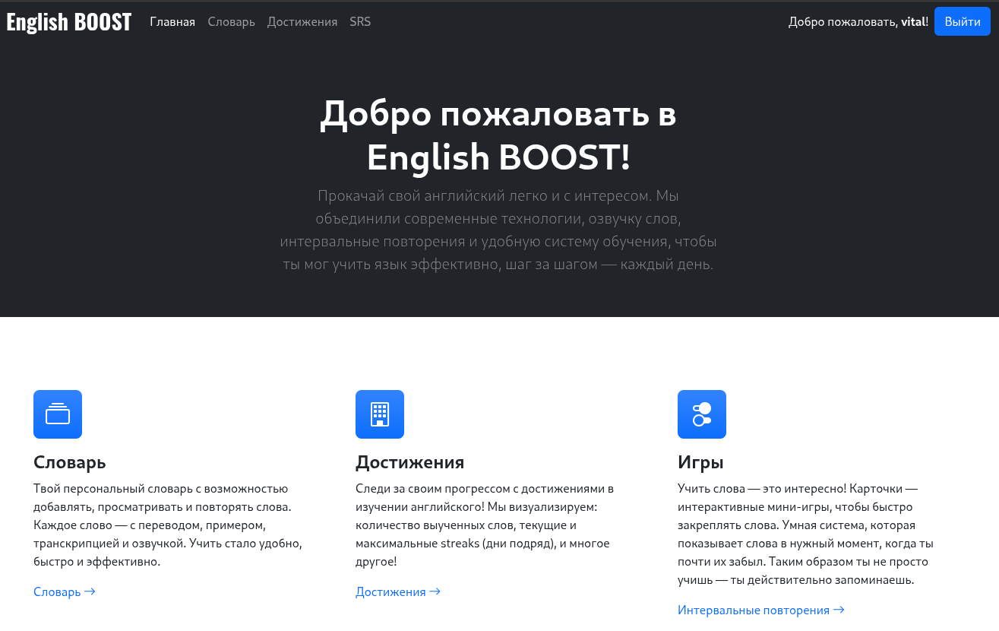
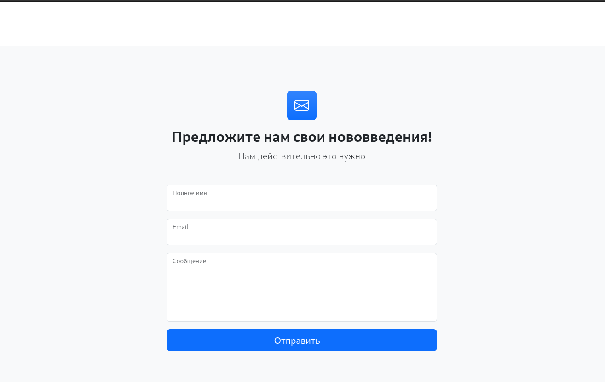
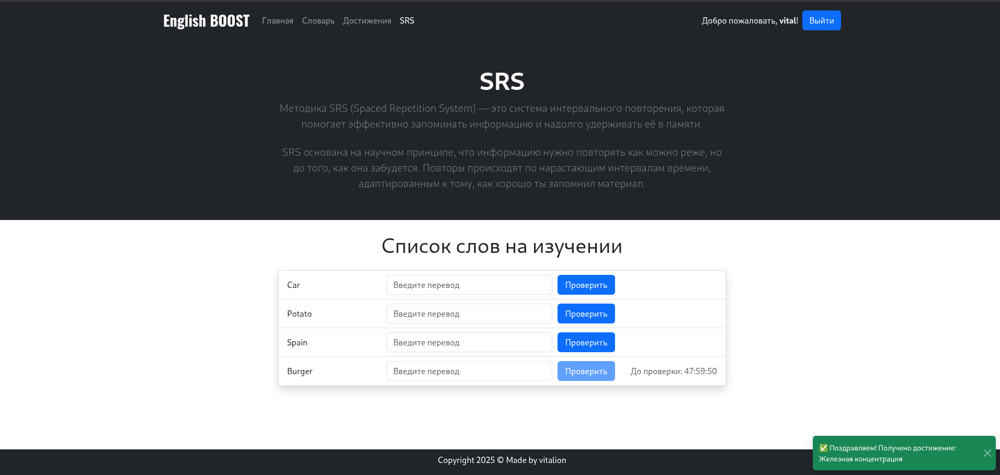
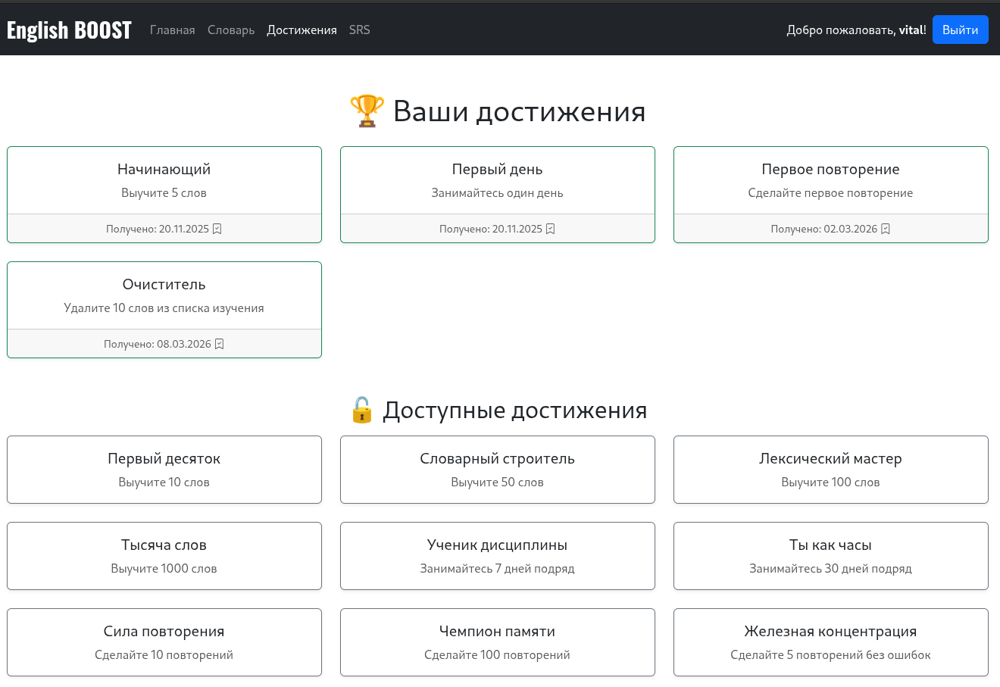
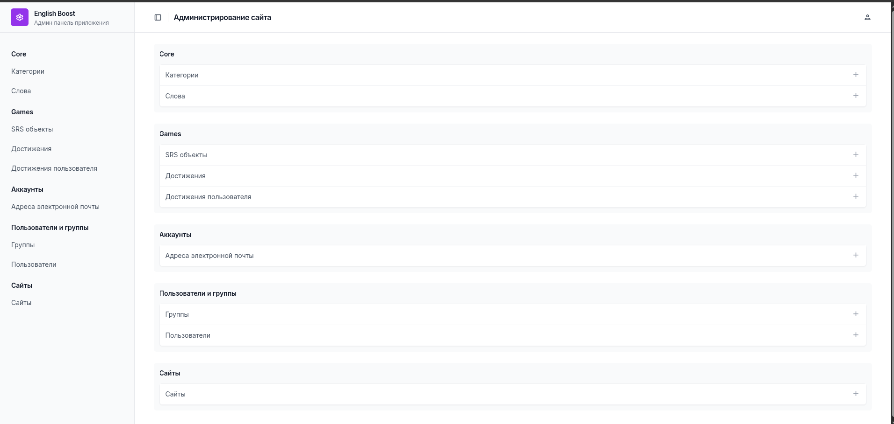

# English Boost

English Boost is a Django web application designed to help users learn English. The project offers an interactive and
user-friendly platform with a spaced repetition system (SRS), a personal dictionary, and an achievement system.

## Features

- 📚 Personal dictionary — add words to study and listen to pronunciation.
- 🔁 Spaced repetition (SRS) — words appear in the test at the right time so you don’t forget them.
- 🏆 Achievement system — get rewards for progress and regular practice.
- 🔐 Authentication system — convenient and simple registration and login system.
- 🛠️ Admin panel with Unfold — a modern admin panel.
- 🐳 Fully Docker-ready — easy to run and deploy with Docker Compose.

## Technologies

* Django 5.2
* PostgreSQL
* Redis
* Docker
* django-allauth
* django-unfold

## 👨‍💻 Docker Installation

1. Clone the repository
    ```bash
    git clone https://github.com/vitaleoneee/english-boost.git
    cd english-boost

2. Create an .env file and fill the required variables:
   ```bash
   cp .env.example .env
   
   # Fill the variables in the newly created file with your data
      DB_NAME=english-boost
      DB_USER=postgres
      DB_PASSWORD=your-db-password
      ...
   
   # Fill the variables in the docker-compose.yaml file
      POSTGRES_PASSWORD=password
      POSTGRES_USER=postgres
      POSTGRES_DB=dbname
3. Build and run the containers:
    ```bash
    docker compose up --build --watch

This will automatically:

* Wait for PostgreSQL
* Apply migrations
* Load fixtures
* Start the Django server

🔧 Useful Docker Commands

1. Rebuild containers:
    ```bash
    docker compose up --build --watch

2. Run in background:
    ```bash
    docker compose up -d

3. Stop:
    ```bash
    docker compose down

4. View logs:
    ```bash
   docker compose logs -f

## Below is a detailed guide on how to install the application WITHOUT Docker 👇

<details>
Installation

1. Clone the repository or copy the project folder to your local machine.
    ```bash
    git clone https://github.com/vitaleoneee/english-boost.git

2. Navigate to the project folder:
   ```bash
   cd english-boost
3. Create and activate a virtual environment:
    ```bash
   python -m venv .venv
   source .venv/bin/activate      # for Linux/macOS
    .venv\Scripts\activate         # for Windows
4. Install dependencies:
   ```bash
   pip install -r requirements.txt

5. Install Redis

- Windows:
  Download the installer from [here](https://github.com/tporadowski/redis/releases)
- Ubuntu/Debian:
    ```bash
    sudo apt update
    sudo apt install redis-server
    sudo service redis-server start
- macOS (Homebrew):
    ```bash
    brew install redis
    brew services start redis

6. Open the folder and Start Redis
    ```bash
   redis-server

7. Create a .env file based on the example:
   ```bash
   cp .env.example .env

8. Specify variables in .env
    ```bash
    DEBUG=True
    SECRET_KEY=your-secret-key
    DB_NAME=your-db-name
    DB_USER=your-user
    DB_PASSWORD=your-password
    DB_HOST=localhost
    DB_PORT=5432
    EMAIL_HOST_USER=your-email@gmail.com
    EMAIL_HOST_PASSWORD=your-email-password
    REDIS_HOST=localhost
    REDIS_PORT=6379
    REDIS_DB=0

9. Set up the database (*Make sure PostgreSQL is running and the database is created.*)
    ```bash
    python manage.py migrate
10. Create a superuser
    ```bash
    python manage.py createsuperuser
11. Start the server
    ```bash
    python manage.py runserver

</details>

## 📸 Screenshots

### 🔍 Main page




### 🧠 Srs system



### 🏆 Achievements



### ⚙️ Admin Panel

